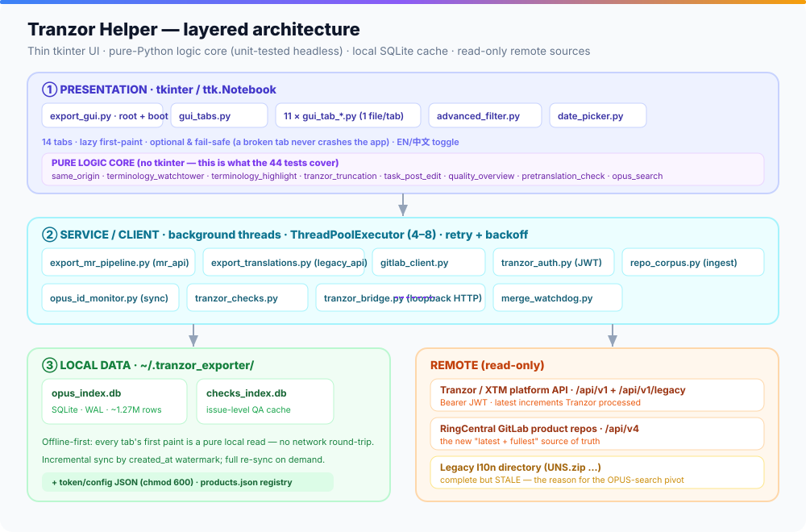
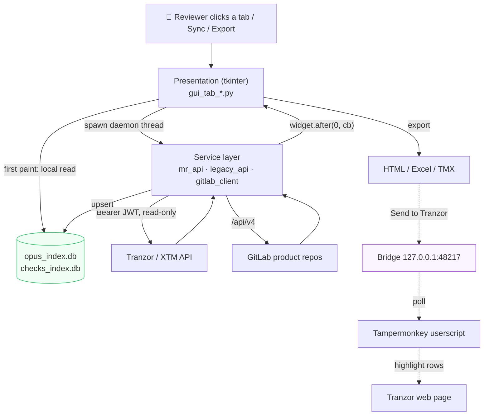
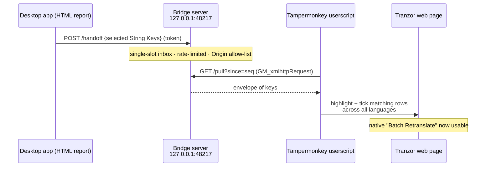
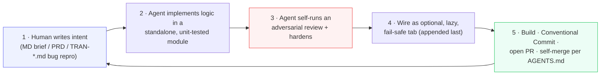

# ARCHITECTURE — Tranzor Helper

> Technology stack · architecture overview · major design decisions · AI tooling & agent workflow.
> Companion documents: [README.md](README.md) · [SPEC.md](SPEC.md) · [RETROSPECTIVE.md](RETROSPECTIVE.md)

---

## 1. Technology stack

A deliberately **minimal, stdlib-heavy** stack. The guiding constraint: the artifact must be a single double-clickable file for a non-technical user, so every dependency is a packaging liability.

| Concern | Choice | Notes |
|---|---|---|
| Language / runtime | **Python 3.12** | Modern typing (`from __future__ import annotations`, `X | None`); bundle ships `python312.dll`. |
| GUI | **`tkinter` / `ttk`** (stdlib) | Tabbed `ttk.Notebook`; charts drawn on a `Canvas` (no matplotlib). Chosen over Gradio (~120 MB) / Qt — tkinter packs to ~25 MB and needs no extra install. |
| HTTP | **`requests`** | The *only* networking dependency. The Bridge server is pure stdlib `http.server` on purpose, so PyInstaller needs no extra hook. |
| Persistence | **`sqlite3`** (stdlib, WAL mode) | Local caches `opus_index.db` + `checks_index.db` in `~/.tranzor_exporter/`. |
| Spreadsheets | **`openpyxl`** | The only other third-party dependency, for `.xlsx` export. |
| Concurrency | **`threading`** + **`concurrent.futures.ThreadPoolExecutor`** | Daemon workers; UI marshalling via `widget.after(0, …)`. No asyncio. |
| Diff / parsing | **`difflib`**, **`re`**, **`json`**, **`html`**, **`urllib.parse`** | All stdlib. TMX is generated browser-side to avoid an XML dependency. |
| Packaging | **PyInstaller** (one-file) | `TranzorExporter.spec` (Windows) · `TranzorExporter_mac.spec` (universal2 macOS). |
| CI/CD | **GitHub Actions** | `build-windows.yml` + `build-mac.yml` on the build mirror; produce downloadable binaries. |
| Tests | **`unittest`** (stdlib) | 44 `test_*.py` files; network always faked/mocked; tkinter never instantiated. |
| Browser bridge | **Tampermonkey userscripts** | 3 scripts (`userscript/`), ~2K lines of JS, talking to the loopback server. |

> **Runtime dependency footprint: two packages** (`requests`, `openpyxl`). Everything else is the Python standard library. This is the single most important stack decision — it is what makes "double-click and it runs" achievable.

---

## 2. Architecture overview

Tranzor Helper is a **three-layer desktop application**: a thin tkinter presentation layer, a pure-Python logic/service core that is fully unit-testable without a display or network, and a local-SQLite data layer fronting three read-only remote sources.

The same shape as a request flows through it:

### 2.1 Layer responsibilities

**① Presentation — `tkinter`.** `export_gui.py` (the PyInstaller entry point) owns the root window, the notebook, app-wide state, auth bootstrap, and the bridge lifecycle, and hosts the **File Translation** core tab directly; `gui_tabs.py` hosts the other two core tabs (MR Pipeline, Quality Overview). Each of the remaining **eleven** tabs lives in its own `gui_tab_*.py`, constructed as `Tab(frame, app)` inside a `try/except` so a failure only logs `[X tab] init failed` and leaves the rest of the app intact — **3 core + 11 optional = 14**. Shared UI: `advanced_filter.py` (the reusable filter panel) and `date_picker.py` (a dark calendar).

**② Service / client.** `export_mr_pipeline.py` (`mr_api`) and `export_translations.py` (`legacy_api`) are the Tranzor platform HTTP clients; other modules reuse them rather than re-implementing auth/retry. `gitlab_client.py` wraps GitLab `/api/v4`. `tranzor_auth.py` injects the JWT. `opus_id_monitor.py` / `opus_search.py` / `repo_corpus.py` build and query the index. `tranzor_bridge.py` runs the loopback server. `merge_watchdog.py` is a cancellable background poller.

**③ Data.** Two SQLite databases in WAL mode; remote sources are read-only. The unifying key everywhere is the **OPUS ID**, pre-split on insert into `(alias, path_hash, logical_key)` so per-project / per-file queries never slice strings at runtime.

### 2.2 The "three sources" reconciliation (the heart of the data model)

The tool's central insight is that the **same translation truth lives in three places with different freshness/completeness trade-offs**, and its job is to converge them into one local index keyed by `opus_id`:

| Source | Freshness | Completeness | Role |
|---|---|---|---|
| **Tranzor / XTM API** | 🟢 latest | 🟡 partial (only strings Tranzor touched) | live increments |
| **GitLab product repos** | 🟢 latest | 🟢 fullest (translations now write back here) | the new ground truth |
| **Legacy l10n directory** (`UNS.zip`…) | 🔴 stale | 🟢 complete | being retired |

After Tranzor went live, translations write back **only to the GitLab product repos** — so the legacy full-export bundles went stale. This is *the* architectural pivot of the project (the "OPUS-search pivot," see [RETROSPECTIVE.md](RETROSPECTIVE.md) §D): `repo_corpus.py`, driven by `products.json`, ingests the GitLab baseline into the same `opus_index` table to make search "latest **and** fullest."

---

## 3. Major design decisions

### D1 — Offline-first via local SQLite
Every tab's first paint is a pure local read, so the app is useful with no network. Sync is **incremental by default** (only tasks newer than the `last_sync_at` watermark in a `sync_meta` table), full re-sync on demand. SQLite runs **WAL + one-connection-per-call + no global lock** — a deliberate fix after an earlier `threading.RLock` held for the whole sync starved UI reads. WAL's native multi-reader/single-writer model replaced it.

### D2 — Background threading, never block the UI
The tkinter main loop is sacred. Every fetch/export/login runs on a `daemon=True` thread, and results return via `self.root.after(0, callback, …)`. Bulk fetch uses a `ThreadPoolExecutor` whose width was tuned **down** to **4 workers for the primary MR pipeline** (`export_mr_pipeline.py: MAX_WORKERS = 4`) after an initial value of 8 overwhelmed the internal server with timeouts (see [RETROSPECTIVE](RETROSPECTIVE.md) §D, "aggressive concurrency"); a few read-only bulk paths still use 6–8. Even the bridge bootstrap is async (writing `port.json` cost 100–300 ms), and consumers tolerate `self.bridge is None` during the startup window.

### D3 — Pure logic extracted from the GUI (why a GUI app has 44 tests)
Domain logic lives in **tkinter-free modules** (`same_origin.py`, `terminology_watchtower.py`, `terminology_highlight.py`, `tranzor_truncation.py`, `task_post_edit.py`, `opus_search.py`). They take injected client callables, so tests exercise them headlessly with in-memory fakes and `unittest.mock` — no display, no live HTTP. (`advanced_filter.py` is a hybrid: its match/serialization engine is GUI-free and tested, while its filter-panel widgets are tkinter.) The GUI shells stay thin. This separation is what makes test-guarded refactoring of a desktop app possible.

### D4 — One-file-per-tab, optional & fail-safe
New capability is "pure-additive": a new `gui_tab_*.py`, imported in a top-level `try/except`, appended **last** in the notebook so existing tab indices don't shift, wrapped so a broken tab can't crash the app. This is the structural reason ~12 features could be accreted onto a live tool without destabilising it.

### D5 — The Tranzor Bridge (loopback HTTP + userscript)
The desktop app can't reach into Tranzor's browser page, and the browser can't freely call localhost. So:

Security is layered: binds the first free port in `48217–48227`, **loopback only**, per-route Origin allow-list, a shared-secret token, a token-bucket rate limiter (5 req/s, burst 10), a 1 MiB body cap, and a single-slot inbox. A `MIN_USERSCRIPT_VERSION` ↔ userscript `@version` handshake forces stale installs through `bridge_setup_wizard.py`.

### D6 — Transparent authentication by monkeypatch
When the platform made Bearer-JWT mandatory, rather than edit dozens of call sites, `tranzor_auth.py` monkeypatches `requests.Session.request` **once** at startup. A pure `apply_auth(url, headers)` decides injection by a **host allow-list** (platform hosts only — never GitLab), which makes it unit-testable with zero real HTTP. The JWT is stored token-only (chmod 600); expiry is read by an unverified base64 decode purely to *prompt* re-login (the server stays the real authority).

### D7 — Packaging tuned for cold-start and foolproofness
PyInstaller **one-file** (a `one-dir` detour was reverted: users ran the `.exe` from inside the zip viewer, `_internal\` never materialised, and it crashed on `python312.dll`). Tcl/Tk DLLs are bundled explicitly; the tkinter packaging hazard (PyInstaller silently excluding `tkinter`) is defended three ways — a custom `pre_find_module_path` hook, a runtime hook (`pyi_rth_tkinter_fix.py`) that points `TCL_LIBRARY`/`TK_LIBRARY` at the bundled runtime, and explicit asset collection. Aggressive `excludes` (`setuptools`, `pkg_resources`, `unittest`, `pydoc`, …) cut the number of files the one-file bootloader unpacks to `%TEMP%`, reducing Windows Defender scan time on launch.

### D8 — Honest failure as a product principle
Partial failures are surfaced, never hidden: failed fetches are excluded from drift analysis (not mis-flagged), full export refuses to silently drop a key, and uncertain provenance is explicitly marked. In a domain where a missing row looks exactly like "no such string," honesty is a feature.

---

## 4. AI tooling used

This codebase was built **AI-native** — the architecture above was produced primarily by AI agents under human direction.

| Tool | Role | Evidence in-repo |
|---|---|---|
| **Claude Code** (Opus 4.6 → 4.7 → 4.8) | Primary implementation agent for the whole April-onward history | **119 of 200** commits on `master` carry a `Co-Authored-By: Claude` trailer; `claude/*` PR branches; `.claude/` settings & worktrees; [AGENTS.md](AGENTS.md) |
| **Google Gemini "Antigravity"** | Earliest pre-repo prototyping of the original export tool | `.gemini/antigravity/brain/…` asset path embedded in `walkthrough.md` |
| **(planned) Claude / OpenAI SDK** | NL quality summaries & RCA — *roadmap, not yet shipped* | `ROADMAP.md` Phase 4 |

The contract is deliberately **tool-agnostic**: `AGENTS.md` grants its merge authority to "Claude Code **or any similar coding agent**," and `mac_build_guide.md` explicitly notes that switching AI tools should not change build results as long as the new tool obeys the same repo rules. The full tool-by-tool retrospective is in [RETROSPECTIVE.md](RETROSPECTIVE.md) §A.

---

## 5. Agent workflow

The repository is engineered *for* agents. Three artifacts make autonomous, multi-session AI development safe and repeatable:

- **[AGENTS.md](AGENTS.md)** — the operating contract. Scope guard (the parent `Tranzor-Platform` is read-only; only `my-tools` is writable), build rules (releases must go through the spec/CI, never ad-hoc PyInstaller), and a **pre-authorized autonomous PR-merge** rule (granted in chat 2026-05-14) with explicit safety gates and hard stops.
- **`.agent/context.md`** — the always-read-first context (scope, conventions).
- **`.agent/workflows/build-and-push.md`** — a codified post-change build-and-deploy workflow.

A typical change cycle:

Evidence the workflow ran as designed: **200 commits / ≈120 PRs (latest merged is #123) in ~11 weeks**, disciplined Conventional Commits (**77 `feat` · 58 `fix` · 17 `docs` · 10 `perf`** on `master`), the majority of commit bodies referencing tests, and parallel Claude Code **git worktrees** on disk for concurrent agent sessions. The signature pattern — *spec → standalone tested module → adversarial self-review → fail-safe wiring → self-merge* — is dissected with examples in [RETROSPECTIVE.md](RETROSPECTIVE.md) §B.

---

## 6. Known limitations & forward architecture

- **No live integration tests / no E2E.** By design — there is no test against a live Tranzor/GitLab server; the logic core is well covered, but tkinter widget code and the userscripts rely on the manual *real-open* release gate.
- **Single-user, local state.** No server, no shared DB (a `ROADMAP.md` item if the team grows).
- **Performance cliff at extreme scale.** A ~150K-row HTML report can approach browser memory limits; trie/memoization/size-guards mitigate it, virtual scrolling is planned.
- **Deterministic-only QA.** LLM-based summaries and RCA are roadmap (Phase 4), kept out of the current phase for reproducibility.

See [RETROSPECTIVE.md](RETROSPECTIVE.md) for how these limitations were discovered and what they taught us.
