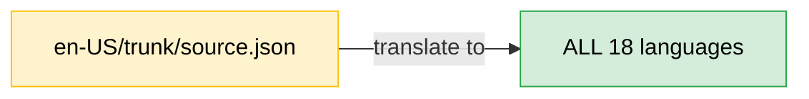
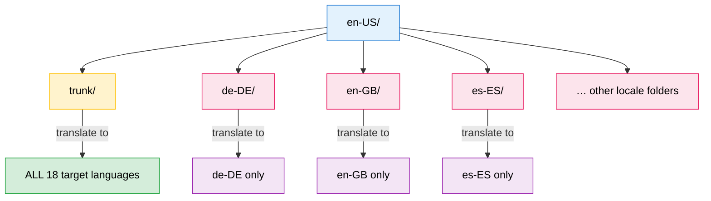
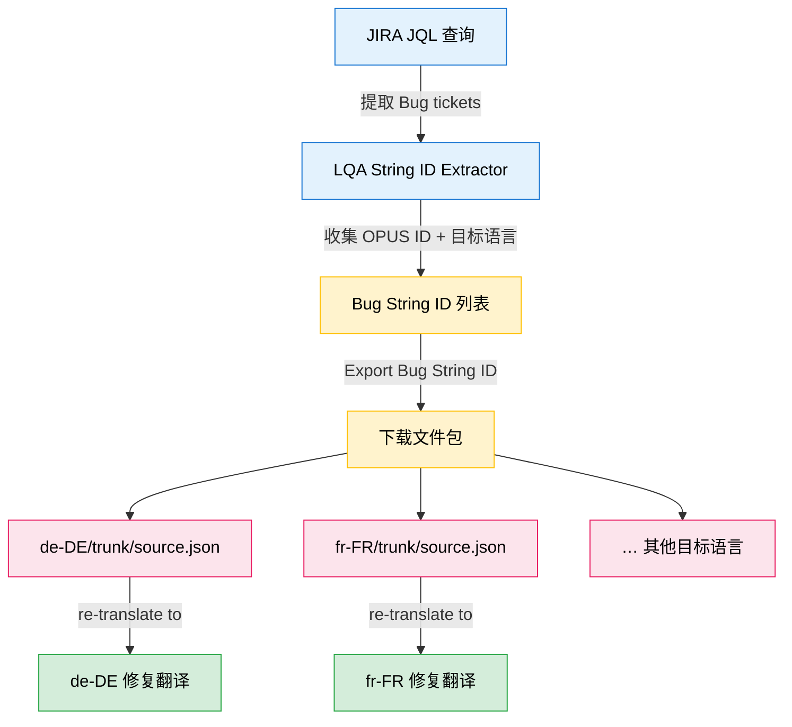

# CHC Source Package Structures — Reference for Tranzor Platform

> **Audience:** Tranzor Platform developers  
> **Author:** CHC Localization Team  
> **Purpose:** Describe the real-world source package layouts and translation scope rules that Tranzor must handle.

---

## 1. Product Portfolio

The CHC component owns **6 core products**, split into two language tiers:

### Tier A — 18 Languages (5 products)

| # | Product |
|---|---------|
| 1 | Service Web |
| 2 | UNS |
| 3 | Analytics Portal |
| 4 | IVA MFE |
| 5 | NGBS |

**Supported languages:**

| Code | Language |
|------|----------|
| `de-DE` | Deutsch |
| `en-AU` | English (Australia) |
| `en-GB` | English (U.K.) |
| `en-US` | English (U.S.) — **source** |
| `es-ES` | Español |
| `es-419` | Español (Latinoamérica) |
| `fr-FR` | Français |
| `fr-CA` | Français (Canada) |
| `it-IT` | Italiano |
| `nl-NL` | Nederlands |
| `pt-BR` | Português (Brasil) |
| `pt-PT` | Português (Portugal) |
| `fi-FI` | Suomi |
| `ko-KR` | 한국어 |
| `ja-JP` | 日本語 |
| `zh-CN` | 简体中文 |
| `zh-TW` | 繁體中文 |
| `zh-HK` | 繁體中文 (香港) |

### Tier B — 9 Languages (1 product)

| # | Product |
|---|---------|
| 6 | SCP |

**Supported languages:** `en-US`, `en-GB`, `es-419`, `es-ES`, `de-DE`, `fr-FR`, `fr-CA`, `it-IT`, `pt-PT`

---

## 2. Source Package Layout

All source packages contain **only `en-US` source strings**. There are **three distinct scenarios** based on工作任务类型和是否存在品牌特定资源：

- **Scenario 1 & 2** — 常规新译任务（New Translation），顶层入口始终为 `en-US/` 文件夹
- **Scenario 3** — 错误修复任务（Bug Fixing），顶层入口为**目标语言**文件夹

### Scenario 1: Trunk Only (Simple) — New Translation

When there are no brand-specific overrides, the package contains only a `trunk` subfolder. **All strings translate to all supported target languages.**

```
LOC-XXXXX/
└── en-US/                          ← source language root
    └── trunk/                      ← translate to ALL target languages
        └── opus_jsons/
            └── 03394108132025/
                └── source.json
```



### Scenario 2: Trunk + Brand Subfolders (Complex) — New Translation

When the product has brand-specific resources, the `en-US` folder contains:
- **`trunk/`** — global strings → translate to **all** target languages
- **`<locale>/` subfolders** (e.g. `de-DE`, `en-GB`, …) — brand-specific strings → translate to **only those listed locales**

```
LOC-21869/
└── en-US/                          ← source language root
    ├── de-DE/                      ← brand-specific: translate ONLY to de-DE
    │   └── opus_jsons/…/source.json
    ├── en-GB/                      ← brand-specific: translate ONLY to en-GB
    │   └── opus_jsons/…/source.json
    ├── en-US/                      ← brand-specific: US English override
    │   └── opus_jsons/…/source.json
    ├── es-419/                     ← brand-specific: translate ONLY to es-419
    │   └── opus_jsons/…/source.json
    ├── es-ES/
    │   └── opus_jsons/…/source.json
    ├── fr-CA/
    │   └── opus_jsons/…/source.json
    ├── fr-FR/
    │   └── opus_jsons/…/source.json
    ├── it-IT/
    │   └── opus_jsons/…/source.json
    ├── nl-NL/
    │   └── opus_jsons/…/source.json
    └── trunk/                      ← global: translate to ALL target languages
        └── opus_jsons/…/source.json
```



### Scenario 3: Bug Fixing — Target-Language-Rooted Package

> [!IMPORTANT]
> 此场景的文件包结构与 Scenario 1/2 **根本不同**：顶层文件夹不是源语言 `en-US/`，而是**目标语言**（如 `de-DE/`、`fr-FR/`）。

#### 业务背景

Bug Fixing 不是全新翻译，而是对已上线翻译中 LQA（语言质量评估）发现的缺陷进行修复。流程如下：

1. **收集 Bug 信息** — 内部 LQA String ID Extractor 工具通过 JIRA JQL（定义了全部待修复的 Bug tickets）提取每条 Bug 的目标语言及对应的 OPUS ID（待修复源字符串的唯一标识 Key）
2. **导出修复文件包** — 在 LQA String ID Extractor 中点击  "Export Bug String ID"，填入项目名称（OPUS ID 句点分割的第二部分，如 `scp`、`scpb`）和最新分支，工具将导出所有 OPUS ID 对应的最新英文源字符串供下载
3. **文件包结构** — 下载的文件包以**目标语言**为顶层子文件夹，每个语言文件夹内仅包含该语言需要修复的英文源字符串

#### 文件包结构

```
LOC-24428/
├── de-DE/                          ← target language: fix bugs for de-DE
│   └── trunk/
│       └── opus_jsons/
│           └── source.json         ← en-US source strings to be re-translated into de-DE
└── fr-FR/                          ← target language: fix bugs for fr-FR
    └── trunk/
        └── opus_jsons/
            └── source.json         ← en-US source strings to be re-translated into fr-FR
```

> [!NOTE]
> 不同目标语言文件夹中的 `source.json` 内容**可能不同**——每个语言仅包含该语言需要修复的那些字符串。例如 `fr-FR/` 下可能有 3 条字符串，`de-DE/` 下只有 1 条，取决于各语言的 Bug 数量。

#### Mermaid 流程图



#### OPUS ID 结构示例

OPUS ID 的格式为：`<Organization>.<Project>.<Hash>.<Path>.<StringKey>`

| Bug Ticket | 目标语言 | OPUS ID 示例 |
|------------|----------|-------------|
| LOC-24432 | `fr-FR` | `RingCentral.scpb.16e144a398470590ff9a91621e6bf47e.sp_1349_name` |
| LOC-24431 | `de-DE` | `RingCentral.scp.37a98a35035b2e321a378f073715e258.phoneCustomProvisioning.ACTION` |
| LOC-24430 | `fr-FR` | `RingCentral.scp.37a98a35035b2e321a378f073715e258.phoneCustomProvisioning.APPLIED_CUSTOM_CONFIGURATION` |
| LOC-24429 | `fr-FR` | `RingCentral.scp.90802117a5a402e8b85025bdc6bcbde.leftMenu.menuItems.ACCOUNT.APPDEVICES.MULTI_USER_DEVICE_TYPES` |

> OPUS ID 中句点分割的第二部分（如 `scp`、`scpb`）即为项目名称，导出时需填写。

#### Detection Rule（Tranzor 实现要点）

```
IF   top-level subfolders are locale codes (e.g. de-DE/, fr-FR/)
     AND no en-US/ folder exists at the top level
THEN this is a Bug Fixing package:
  - Each top-level folder name = one target language
  - source.json inside each folder = en-US strings to re-translate for THAT language only
  - Create a separate translation task list for EACH target language folder
```

> [!CAUTION]
> Tranzor 必须能够区分以下两种情况：
> - **Scenario 2** 中 `en-US/` 下的 locale 子文件夹（品牌场景，source strings 用英文翻译到指定 locale）
> - **Scenario 3** 中顶层的 locale 文件夹（Bug Fixing 场景，文件夹名即为目标语言）
>
> 关键区别：Scenario 2 的顶层始终是 `en-US/`，而 Scenario 3 的顶层**没有** `en-US/`，直接是目标语言文件夹。

---

## 3. Brand-Specific Resources Explained

### What is a "Brand"?

A **brand** is a white-label or co-branded variant of the RingCentral product, customized for a specific carrier or partner (e.g. AT&T, BT, Telus). Each brand supports a **subset** of the full 18-language list.

### How it affects translation

| Folder | Meaning | Translation Scope |
|--------|---------|-------------------|
| `en-US/trunk/` | Global resources (shared across all brands) | → All target languages for that product |
| `en-US/<locale>/` | Brand-specific overrides | → **Only** that specific `<locale>` |

### Example: Brand 3460 (AT&T Office@Hand UB)

Brand 3460 supports **8 target languages**: `en-GB`, `fr-CA`, `fr-FR`, `de-DE`, `it-IT`, `es-ES`, `nl-NL`, `es-419`

When a source package contains brand 3460 resources, you will see exactly these 8 locale subfolders under `en-US/`, plus `trunk/`.

> [!IMPORTANT]
> The subfolder names under `en-US/` **directly indicate** the target languages for those brand-specific strings. The presence of `en-US/de-DE/` means "these source strings should be translated into `de-DE` only."

### Detection Rule (for Tranzor implementation)

```
IF   en-US/ contains only trunk/
THEN translate trunk/ → all product target languages

IF   en-US/ contains trunk/ + locale subfolders
THEN
  - trunk/         → all product target languages
  - <locale>/      → that single locale only
```

---

## 4. Summary Matrix

| Dimension | Scenario 1 (Simple) | Scenario 2 (Brand-specific) | Scenario 3 (Bug Fixing) |
|-----------|---------------------|----------------------------|------------------------|
| 任务类型 | 新译（New Translation） | 新译（New Translation） | 错误修复（Bug Fixing） |
| Folder structure | `en-US/trunk/` | `en-US/trunk/` + `en-US/<locale>/` | `<target-locale>/trunk/` |
| Top-level entry | `en-US/` | `en-US/` | Target language folders (e.g. `de-DE/`, `fr-FR/`) |
| Source language | `en-US` | `en-US` | `en-US` (文件内容仍为英文源) |
| Target scope (trunk) | All product languages | All product languages | N/A |
| Target scope (locale folders) | N/A | One language per folder | One language per folder |
| 目标语言确定方式 | 由产品配置决定 | 子文件夹名 = 品牌目标语言 | 顶层文件夹名 = 修复目标语言 |
| 各语言 source.json 内容 | 相同 | 各品牌可能不同 | **每种语言不同**（仅含该语言的 Bug 字符串） |
| Brand association | None | Determined by external brand config | None |
| Real-world frequency | Common | Less frequent, but critical | Periodic (LQA cycles) |
| 数据来源 | OPUS 全量导出 | OPUS 全量导出 | LQA String ID Extractor（基于 JIRA Bug tickets） |

> [!NOTE]
> The full brand ↔ language mapping is maintained in a separate matrix document:
> [BrandProduct supported languages matrix.pdf](file:///c:/Users/susu82/Tranzor-Platform/my-tools/BrandProduct%20supported%20languages%20matrix.pdf)
