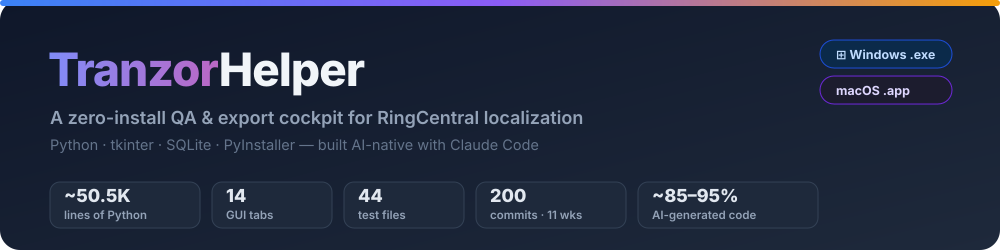
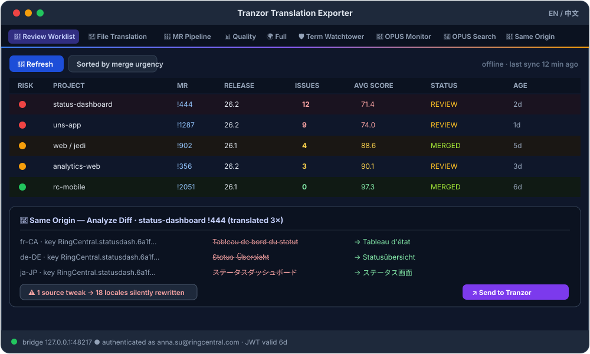
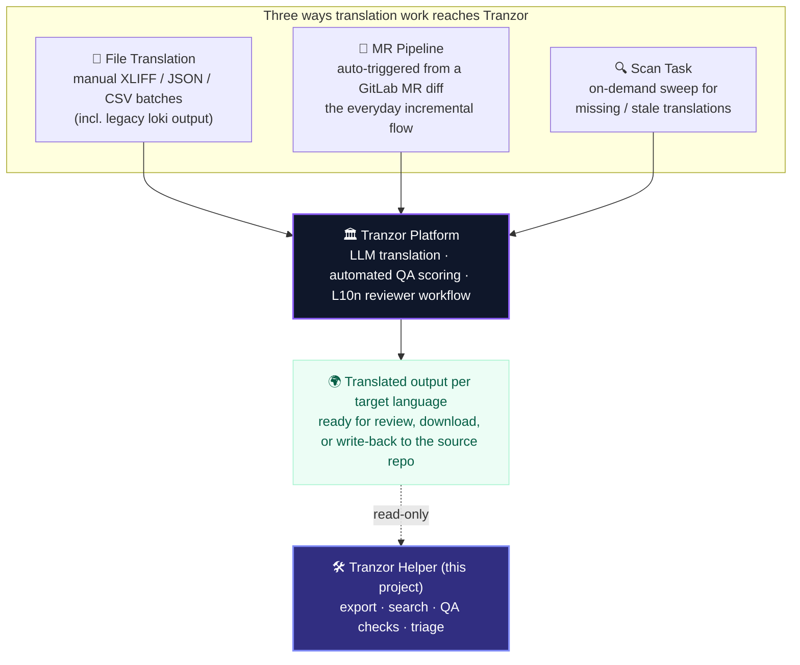

<!-- Project face / 项目门面 -->



<div align="center">

**`Python 3.12`** · **`tkinter`** · **`SQLite (WAL)`** · **`PyInstaller`** · **`Windows .exe`** · **`macOS .app`**
**Built AI-native with Claude Code (Opus 4.6 → 4.7 → 4.8)**

</div>

> **About this repository.** This project is RingCentral's *AI-Native Development Challenge* submission. The challenge invites a "small but complete software project" — a card game is only the *suggested* vehicle; the real objective is to **experience and document the full AI-native development lifecycle**. Rather than a throw-away game, this submission documents a **real, shipped tool** built almost entirely by directing AI coding agents: **Tranzor Helper**, a ~50,500-line desktop application used daily by RingCentral's localization team. The four required deliverables are [README.md](README.md), [SPEC.md](SPEC.md), [ARCHITECTURE.md](ARCHITECTURE.md) and the highest-weighted [RETROSPECTIVE.md](RETROSPECTIVE.md).

---

## Table of contents

- [What is Tranzor Helper?](#what-is-tranzor-helper)
- [▶ Live demo](#-live-demo)
- [Screenshots](#screenshots)
- [How translation work reaches the platform](#how-translation-work-reaches-the-platform)
- [Feature tour](#feature-tour)
- [Setup and install](#setup-and-install)
- [Run instructions](#run-instructions)
- [Repository structure](#repository-structure)
- [The four challenge deliverables](#the-four-challenge-deliverables)
- [Built AI-native](#built-ai-native)

---

## What is Tranzor Helper?

**Tranzor Helper** (internally *TranzorExporter*; GitLab repo `annasu-tranzor-helper`) is a **zero-install, zero-dependency desktop application** that acts as a personal **quality-assurance & export cockpit** for the people who run localization on RingCentral's **Tranzor** platform.

Tranzor is RingCentral's in-house localization platform — a browser front-end over an XTM-style translation-management system that produces machine + human translations across ~18 locales. It is owned by another team and ships on a slow release cadence, but a localization reviewer needs **safeguards and exports today**. Tranzor Helper fills that gap: a single double-clickable executable opens one window with **14 tabs** that let a non-technical language professional:

- 📤 **export** translations to HTML / Excel / TMX (XTM-compatible) without ever touching a terminal;
- 🔎 **search** every translation string the platform has ever produced — instantly, offline, from a local index;
- 🛡️ **run deterministic QA checks** — terminology compliance, pre-translation coverage, cross-task drift, error-keyword triage;
- 🎯 **triage** a daily review worklist that compresses 70+ merge requests into the ~5 that actually need eyes;
- ↗️ **act** — tick problem rows and let the app drive Tranzor's own web UI straight to the strings that need fixing.

Everything is **read-only** against the platform, and almost every screen paints its first frame from a **local SQLite cache**, so the app opens instantly even with no network.

> **Who it's for.** A translation reviewer / localization PM — an expert in CAT tools (XTM, MemoQ, Trados) and a daily heavy Tranzor user, but with **no programming or command-line background**. The whole product is shaped around "click → select → act," never "open a terminal and remember flags."

---

## ▶ Live demo

Don't want to install anything? A **hosted, interactive demo** of the **MR Pipeline** view runs on GitLab Pages — open it, hit **🔄 Refresh**, and **double-click any row** to inspect a task and jump to its **Tranzor** and **original GitLab MR** links. No clone, build, or run required: the page is fully self-contained and uses synthetic demo data.

🔗 **Open the live demo:** http://annasu-tranzor-helper-d30d1d.pages.git.ringcentral.com

---

## Screenshots

> The screenshot below is an illustrative rendering of the dark-theme desktop UI (the app is a native tkinter window, so it is not a live web page). It shows the **🎯 Review Worklist** tab and a **🧬 Same Origin** drift analysis.



---

## How translation work reaches the platform

Tranzor Helper exists to reconcile the **three channels** through which translation work flows into the platform. Understanding this picture explains every feature in the tool:



The unifying key across all three channels is the **OPUS ID** — the string identifier Tranzor assigns to every translatable source string:

```
RingCentral.{alias}.{md5(sourceRelativePath)}.{logicalKey}
            └─ product   └─ file fingerprint        └─ string key
```

Tranzor Helper parses this key into structured columns so it can give a reviewer the cross-language "horizontal view" they actually need: **one English source + its latest translation in every locale.**

---

## Feature tour

The window is a `ttk.Notebook`. The first three tabs are core; the remaining eleven are **optional, lazy-loaded, fail-safe** tabs (a broken tab degrades to a missing tab — it never crashes the app).

| Tab | What it does | Why it matters |
|---|---|---|
| 📁 **File Translation** | Export a legacy/manual job (by Task ID or all) to HTML/Excel; the HTML report has live filtering, search, in-browser **TMX export**, and `↗ Send to Tranzor`. | One-click export to XTM-compatible TMX — no terminal. |
| 🔀 **MR Pipeline** | Lists GitLab-MR-triggered translation tasks (project, MR#, release, status, source-string count, avg score…) with paging/sorting/filtering and the ✏️ post-edit marker. | The daily view of what the incremental pipeline produced. |
| 📊 **Quality Overview** | Aggregated quality stats with MR & File sub-tabs; flags human-touched items. | At-a-glance quality posture across both channels. |
| 🌍 **Full Translations** | Bulk export by **product × language**; lazy inventory load so startup stays fast, heavy fetch only on export. | Whole-product / whole-locale exports without slow startup. |
| **Human Revisions** | Aggregates every human-edit record across both channels (default last 30 days). | One place to audit and learn from human corrections. |
| 🔎 **Scan Tasks** | Lists "Missing Translation Scan" jobs; filter and export coverage results. | Track coverage sweeps separately from the MR pipeline. |
| 🛡️ **Term Watchtower** | Import an approved glossary, run a **deterministic** (non-LLM) terminology scan, flag every violation with expected-vs-actual + full context, export evidence. | Catch approved-term violations and hand the dev team proof. |
| 🔬 **TM & Context Insight** | Visualizes *where* a translation came from (TM / ICE / cache / LLM / human) and whether Context Service attached context. | Lets non-engineers diagnose bad MT output. |
| 🧬 **OPUS ID Monitor** | Local SQLite cache of every OPUS ID; summary cards, per-project buckets, 30-day new-ID chart. | "Anytime, anywhere" pulse of translation volume. |
| 🩺 **Tranzor Checks** | Full-task check status + sortable **error-keyword aggregation**, drill-down to issue rows. | Group similar issues; classify terminology / format errors. |
| 🎯 **Review Worklist** | Compresses 70+ MRs into ~5–10 rows ranked by **merge urgency × language priority**, with 🔴/🟡/🟢 risk dots (issue counts shown alongside). | The Language Lead's single daily entry point. |
| 🚦 **Pre-Translation Check** | Import an l10n delta XLSX and classify each string: 🟢 skip / 🟡 recheck / 🔴 needs human. | Avoid re-translating what Tranzor already covers. |
| 🔎 **OPUS Search** | Search the local full index by OPUS ID / source / target / product → instant "source + all-locale latest translation." | A fast, fresh replacement for the laggy upstream bundle. |
| 🧬 **Same Origin** | Groups cases where one MR triggered translation **multiple times** and word-diffs them per locale. | Detects drift: "one source tweak → 18 locales silently rewritten." |

**Cross-cutting — the Tranzor Bridge.** A tiny loopback HTTP server (`127.0.0.1`, per-launch token) plus a Tampermonkey userscript lets the desktop app drive Tranzor's own browser page: tick problem rows in a report, click **↗ Send to Tranzor**, and the matching String Keys are auto-highlighted and auto-ticked across all languages so the platform's native *Batch Retranslate* is immediately usable.

**Cross-cutting — Send to LLM QA.** On **File Translation**, **MR Pipeline** and **Scan Tasks**, a `🤖 Send to LLM QA` button (next to *Export Selected*) does the whole LQA hand-off in one click: it exports the selected task's **full-translation JSON** (the audit schema the `/rc-core-products-trans-checker` skill consumes — no need to toggle the format radios), copies the prompt `/rc-core-products-trans-checker 检查附件JSON这批翻译的质量，重点关注 Critical 问题。` to the clipboard, reveals the file, and tells you to upload the attachment and paste the prompt in your LLM chat.

See [SPEC.md](SPEC.md) for the full rules, scope and acceptance criteria, and [ARCHITECTURE.md](ARCHITECTURE.md) for how it is built.

---

## Setup and install

There are two ways to get the app. **Most users want Path A.**

### Path A — Download the pre-built application (recommended, zero setup)

> ℹ️ **On the challenge's "playable from a link" bonus.** That bonus targets browser games — a native desktop tool can't be "played from a URL." The equivalent here is **CI-built, downloadable binaries**: a reviewer downloads one file and runs it, with no clone, no Python, no `pip install`. Continuous integration (GitHub Actions, on the build mirror) builds the binaries — the Windows `.exe` rebuilds automatically on every push to `master`, and the universal macOS `.app` is produced on demand via a manual workflow run.

| Platform | Artifact | How it's built |
|---|---|---|
| Windows 10/11 | `TranzorExporter.exe` (single file) | `Build Windows EXE` workflow → `TranzorExporter-Windows` artifact |
| macOS (Intel + Apple Silicon) | `TranzorExporter.app` inside `TranzorExporter-Mac.zip` | `Build Mac App` workflow → `TranzorExporter-Mac` artifact |

1. Download the artifact for your OS from the latest CI run (or the release location your team shares).
2. **Windows:** unzip if needed, then double-click `TranzorExporter.exe`. No Python required.
3. **macOS:** unzip, move `TranzorExporter.app` to `Applications`. On first launch macOS Gatekeeper may warn (the app is ad-hoc-signed, not notarized) — right-click → **Open**, or run `xattr -dr com.apple.quarantine TranzorExporter.app`.

### Path B — Run from source (for developers)

**Prerequisites:** Python **3.12**. The only runtime dependencies are `requests` and `openpyxl` (`tkinter` and `sqlite3` ship with Python).

```bash
# 1. Clone (GitLab is the canonical repo)
git clone https://git.ringcentral.com/rc-ai-learning/annasu-tranzor-helper.git
cd annasu-tranzor-helper

# 2. Install the two runtime dependencies
pip install requests openpyxl

# 3. Launch
python export_gui.py
```

To build your own standalone binary:

```bash
pip install pyinstaller
# Windows
powershell -File build_windows.ps1          # → dist/TranzorExporter.exe
# macOS
./build_mac.command                          # → dist/TranzorExporter.app
```

---

## Run instructions

1. **Launch** `TranzorExporter.exe` / `.app` (or `python export_gui.py`). A local bridge server starts on `127.0.0.1:48217`; tabs render lazily on first click so cold-start stays fast. Toggle **EN / 中文** at the top-right anytime.
2. **Authenticate.** The platform requires a Bearer JWT. Sign in with your LDAP email + password; the app stores **only** the JWT (never your password) in `~/.tranzor_exporter_auth.json` and attaches it transparently to platform requests. Offline-first tabs (OPUS Monitor/Search, Review Worklist, Tranzor Checks first paint) work from the local cache *before* you log in.
3. **Pick a task / MR** — a row in **🔀 MR Pipeline** or **🔎 Scan Tasks**, a Task ID in **📁 File Translation**, or open **🎯 Review Worklist** to be steered to the highest-priority MRs.
4. **Run checks** — **🚦 Pre-Translation Check** before a job, **🛡️ Term Watchtower** for terminology, **🩺 Tranzor Checks** for error triage, **🔬 TM & Context Insight** for routing, **🧬 Same Origin** for drift. Hit **🔄 Sync** to pull fresh data on demand.
5. **Export / act** — export to **HTML / Excel / TMX**, or tick problem rows and click **↗ Send to Tranzor** to be walked key-by-key through the fix on Tranzor's own page.

---

## Repository structure

```text
annasu-tranzor-helper/
├── export_gui.py                 # ① main entry — root window, notebook, boot, auth, bridge
├── gui_tabs.py                   # core tabs: MR Pipeline + Quality Overview
├── gui_tab_*.py                  # 11 optional tabs, one file each (fail-safe)
├── advanced_filter.py            # shared filter engine (UI + export, kept in sync by tests)
│
├── export_mr_pipeline.py         # ② Tranzor MR-pipeline API client  (mr_api)
├── export_translations.py        #    Tranzor legacy File-Translation client (legacy_api)
├── export_full_translations.py   #    complete-or-fail-loud full export
├── gitlab_client.py              #    RingCentral GitLab /api/v4 client
├── tranzor_auth.py               #    transparent Bearer-JWT injection
├── tranzor_bridge.py             #    loopback HTTP bridge to the browser
├── opus_id_monitor.py            #    local SQLite index + incremental sync
├── opus_search.py / repo_corpus.py  # search service + GitLab full-baseline ingest
├── same_origin.py / terminology_watchtower.py / ...  # pure-logic engines (no tkinter)
│
├── userscript/                   # 3 Tampermonkey userscripts (the browser side of the Bridge)
├── test_*.py                     # 44 unit/regression test files (mostly stdlib unittest)
├── .github/workflows/            # build-windows.yml · build-mac.yml (CI builds binaries)
├── *.spec / build_*.{ps1,command}# PyInstaller packaging
├── products.json                 # product → GitLab-repo registry (drives the OPUS index)
│
├── README.md  SPEC.md  ARCHITECTURE.md  RETROSPECTIVE.md   # ← challenge deliverables
└── AGENTS.md                     # the AI-agent operating contract (see RETROSPECTIVE.md)
```

---

## The four challenge deliverables

| Document | Purpose |
|---|---|
| **[README.md](README.md)** | This file — overview, screenshots, setup & run. |
| **[SPEC.md](SPEC.md)** | Scope, functional requirements, "rules of the game," acceptance criteria. |
| **[ARCHITECTURE.md](ARCHITECTURE.md)** | Tech stack, layered architecture, major design decisions, AI tooling & agent workflow. |
| **[RETROSPECTIVE.md](RETROSPECTIVE.md)** | *(highest-weighted)* AI tools, workflow, what worked / didn't, % AI-generated, lessons for the org. |

---

## Built AI-native

This tool was built over **~11 weeks (Apr 2 → Jun 18 2026)** across **200 commits**, with an estimated **85–95% of the shipped code AI-generated** — primarily by **Claude Code** (Opus 4.6 → 4.7 → 4.8), under a written autonomy contract ([AGENTS.md](AGENTS.md)) that let agents open and merge their own PRs against documented safety gates. The human contribution was domain expertise, specification, review and the merge decision. The full story — including what *didn't* work and the reusable patterns — is in **[RETROSPECTIVE.md](RETROSPECTIVE.md)**.

<div align="center"><sub>RingCentral · rc-ai-learning · AI-Native Development Challenge 2026</sub></div>
