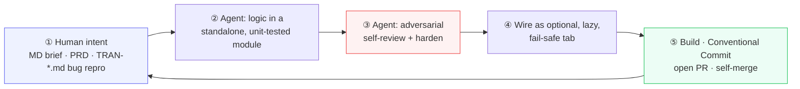

# RETROSPECTIVE — Tranzor Helper

> **The most important deliverable.** Its purpose is to capture *reusable patterns and best practices* for RingCentral's transition to an AI-native engineering organization — not only what worked, but candidly what did not.
> Companion documents: [README.md](README.md) · [SPEC.md](SPEC.md) · [ARCHITECTURE.md](ARCHITECTURE.md)

---

## TL;DR

A **localization specialist with no traditional software-engineering background** built and shipped a **~50,500-line, 14-tab, 44-test desktop application** — used daily by RingCentral's L10n team — over **~11 weeks (Apr 2 → Jun 18 2026, 200 commits)**, by *directing* AI coding agents rather than writing code by hand. An estimated **85–95% of the shipped code was AI-generated** (primarily Claude Code, Opus 4.6 → 4.8). The decisive human skills were **not coding** — they were domain expertise, product judgement, and *process design*: a written agent contract, a test culture, and a release gate that the agents then operated within.

The single most transferable finding: **for a non-engineer driving agents, the written specification *is* the program.** The leverage was almost entirely in how clearly the work was framed, not in keystrokes.

---

## A — AI tools used

### Claude Code — the primary, dominant tool

Evidence is overwhelming and direct from the repo:

- **Co-authored commits name the exact models.** Trailers resolve to three Opus generations — **Opus 4.6 → 4.7 → 4.8**, upgraded *mid-project* (trailer-line counts on `master`: 4.6 ≈ 12, 4.7 ≈ 73, 4.8 ≈ 38; several tagged "1M context"). The most recent feature — the Same Origin tab (`7454ed9`) — is co-authored by `Claude Opus 4.8`. **119 of the 200 commits on `master`** carry a `Co-Authored-By: Claude` trailer.
- **`AGENTS.md`** is an operating contract written *for* Claude Code: *"The repository owner has pre-authorized agents (Claude Code or any similar coding agent) to merge their **own** PRs to `master` without per-PR human approval."*
- **`claude/*` PR branches** — Claude Code's auto-generated naming convention (`claude/platform-auth-login`, `claude/fix-startup-login-deadlock`, plus auto-named ones like `claude/ecstatic-babbage-341737`).
- **`.claude/` infrastructure** — a permission allow-list (`settings.local.json`) and multiple **git worktrees** on disk for parallel agent sessions.

### Google Gemini "Antigravity" — earliest phase

`walkthrough.md` embeds an asset path from Google's Gemini agentic IDE (`.gemini/antigravity/brain/…/gui_mockup_*.png`). Together with the developer diary's generic *"AI Pair Programmer"* credit, this indicates the **earliest prototyping (the March `export_changes.py` predecessor) used a different AI tool** before the project consolidated on Claude Code for the April-onward repo.

### Deliberately tool-agnostic

The human wrote the contract for *agents in general*, not one vendor — `AGENTS.md` grants merge rights to "any similar coding agent," and `mac_build_guide.md` records the principle as *"误区 3：换一个 AI 工具就会改变构建结果 —— 通常不会"* ("Misconception 3: switching AI tools changes the build result — usually it won't").

> No GitHub Copilot, Cursor, Codex or Windsurf evidence appears anywhere in the repo. LLMs as a *runtime product feature* (NL quality summaries) are planned in `ROADMAP.md` Phase 4 but **not yet shipped** — the AI in this project is the *builder*, not (yet) a feature.

---

## B — Development workflow

### The governing idea: write the rules down, once

Instead of re-explaining intent every session, the human front-loaded **durable, in-repo rules** so agents behave consistently across sessions:

- **Scope guard** (`.agent/context.md`): the parent `Tranzor-Platform` product repo is **read-only**; only `my-tools` is writable. (This mirrors the owner's standing rule that the product repo is "绝对只读".)
- **Build rules** (`AGENTS.md`): Windows releases via `build_windows.ps1`/`TranzorExporter.spec`; Mac via the CI workflow — *never* an ad-hoc PyInstaller invocation.
- **Autonomous PR-merge** (`AGENTS.md`, authorized in chat **2026-05-14**): agents may merge **their own** PRs, with explicit gates — *"if no checks are attached … the agent merges based on its own review of the diff. The owner has explicitly accepted that the agent's diff judgment is the gate in the absence of CI"* — and hard stops (a human `REQUEST_CHANGES`, destructive/irreversible changes, un-sandboxable CI changes, any merge error → "report and ask").

### The change cycle



A concrete instance — the **Same Origin** tab (final commit `7454ed9`): the human described the drift problem; the agent built logic in a tkinter-free `same_origin` module with **27 unit tests**; ran an adversarial self-review and recorded the hardening in the commit body (*"robust pagination that no longer trusts an under-reported/zero server `total` … task_id dedup against page-overlap races, int/str MR# key normalization, empty-vs-missing translation no longer false-flagged"*); wired it as a fail-safe tab appended last; then self-merged under the contract.

### Cadence — bursty, not steady

Part-time work sandwiched around a day job produced a spiky rhythm (commits per ISO week on `master`):

| Week | Commits | |
|---|---:|---|
| W14 (Apr) | 18 | `█████████████████▉` |
| W15 | 17 | `████████████████▉` |
| W16 | 4  | `███▉` |
| W17 | 6  | `█████▉` |
| W18 | 5  | `████▉` |
| W20 | 13 | `████████████▉` |
| W21 | 26 | `█████████████████████████▉` |
| **W22** | **56** | `████████████████████████████████████████████████████████` ← peak sprint |
| W23 | 11 | `██████████▉` |
| W24 | 25 | `████████████████████████▉` |
| W25 (Jun) | 19 | `██████████████████▉` |

Per month: **50 (Apr) · 95 (May) · 55 (Jun)**. The 56-commit W22 sprint corresponds to the auth-migration + OPUS-search pivot burst — agents made concentrated, deep changes feasible in short windows.

---

## C — What worked well

1. **Rapid, *additive* feature accretion.** The 3-tab MVP grew to 14 tabs without destabilizing. The "optional, lazy-loaded, fail-safe tab" pattern (see [ARCHITECTURE.md](ARCHITECTURE.md) §D4) meant each new agent-built feature was isolated — it *couldn't* break the daily workflow.

2. **Test-guarded refactors let agents make scary changes safely.** The strongest example: a ~2,500-term terminology-highlight regex was replaced with a **prefix-trie**, proven equivalent across **20,000 random + adversarial inputs** (CJK, shared prefixes, case folds) for a **~1500× per-line speedup** (21 ms → 0.014 ms), plus a ~29× memoization win. That is exactly the kind of optimization you only dare ship with a test net — and the agent wrote both the optimization *and* the equivalence test.

3. **Productization the human could judge but not code.** The `productization_report.md` persona analysis (*"精通 XTM/MemoQ/Trados… 但不具备编程或命令行经验"*; command-line rated *"🔴 致命"*) drove the CLI→GUI decision, and the diary records the trade-off the agent surfaced: *"最初考虑 Gradio，但发现用户环境未安装，且打包体积达 120MB+。tkinter 打包后仅 25MB."*

4. **The autonomy contract removed the human as a per-PR bottleneck.** ≈120 PRs (the latest merged is #123) shipped in 11 weeks part-time precisely because the human wasn't approving each one — the written gate did.

5. **Honest-failure UX as a repeated, enforced principle.** Partial fetch failures are excluded and *announced*, full export refuses to drop a key silently, uncertain provenance is marked. Agents implemented this consistently because it was written down as a rule.

6. **Documentation kept the agent honest.** Writing PRDs and Jira-style bug repros (`TRAN-*.md`, `Terminology_Watchtower_PRD.md`) before implementation gave the agent an unambiguous target — and repeatedly surfaced gaps before code was written.

---

## D — What did not work / friction

1. **The full-export-lag crisis → the OPUS-search pivot (biggest architectural friction).** After Tranzor went live, *"翻译只回写 GitLab 产品仓库，不再回写旧 OPUS/loc-central，故 HTTP 目录的全量包 (UNS.zip 等) 时间戳严重滞后"* (`opus_search.py` header). The upstream "source of truth" had quietly become stale, breaking the bug-fixing workflow. The fix was an entire new subsystem — `opus_search.py` + `repo_corpus.py` + `products.json` — that re-bases truth on the **GitLab product repos**. *Lesson: validate your data source's freshness assumption early; it can rot underneath you.*

2. **A display bug that masqueraded as data corruption.** The UNS Source column showed only ~500 chars with no indicator, so reviewers reasonably concluded extraction had lost content (`TRAN-bug-uns-source-truncated-without-indicator.md`). Disproving it required SHA-256-verifying DB length vs. zip length across six IDs to *prove* "the data is intact; only the display is misleading." *Truncation without an indicator is a lie the UI tells.*

3. **GUI packaging was the longest-running pain.** A string of documented failures, each fixed: macOS shipped ARM-only → *"bad CPU type in executable"* on Intel (fixed via `target_arch='universal2'`, CHANGELOG_20260403); macOS Aqua ignored `tk.Button` colors so buttons rendered flat gray (fixed with a cross-platform button factory); PyInstaller silently excluded `tkinter` so the EXE built but wouldn't launch (fixed with a custom `pre_find_module_path` hook + the `pyi_rth_tkinter_fix.py` runtime hook); and a one-dir packaging detour that broke "run straight from the zip viewer" (the `_internal\` folder never materialised → `python312.dll` load failure) was reverted to one-file, with the rationale recorded in `TranzorExporter.spec`. **CI green did not mean "it runs"** — which is *why* the release checklist now demands a human *real-open*.

4. **Aggressive concurrency crashed the internal server.** The diary's Bug #4: 8 threads *"同时轰击 Tranzor 内网服务，服务端来不及响应"* → `TimeoutError`. Fix "三板斧": drop to `MAX_WORKERS=4`, add `MAX_RETRIES=3` with exponential backoff, per-task try/except. *"激进的并发≠更快，可能适得其反."*

5. **"Two views, one index" data bugs.** Early TMX exports corrupted because JSON serialization order ≠ HTML render order, and CSS-hidden rows were still selected by `querySelectorAll`. *"CSS `display:none` 不是'不存在'."*

6. **Silent mis-attribution from upstream platform quirks.** A fix-commit matcher keyed purely on timestamp could fill in *another* key's translation — picking the closest-by-time `tranzor-fix/...` branch instead of the one whose diff actually edits the target `(opus_id, target_language)`. This "silent wrong-fill" is now pinned by `test_gitlab_client.py::test_picks_branch_whose_diff_contains_key_even_if_not_closest`. Separately, Language-Lead fixes sometimes left `fixed_by_lead = NULL` (`TRAN-bug-fix-translation-audit-trail.md`). The tool had to add multi-factor verification and explicit provenance. *Agents will faithfully reproduce a flawed heuristic unless you make correctness a tested invariant.*

7. **The agent over-trusted API contracts.** Pagination assumed the server's `total` was truthful; it wasn't. Only the adversarial review step caught it (`total` can be under-reported or zero).

---

## E — Surprises & discoveries

- **A QA tool built *on top of* the platform found defects the platform was blind to.** The **Same Origin** discovery — the MR pipeline silently re-translates the same MR multiple times, so *"one source line removed → 18 locales re-polished"* with no warning — is a class of defect Tranzor itself didn't surface.
- **Documentation is a functional audit, not a chore.** Writing the wiki revealed a missing Task-ID field, triggering *"一次'从数据采集到筛选逻辑'的全链路补充——共 7 个修改点."* The diary's verdict: *"文档化是最好的功能审计 … 这种收益无法被单元测试替代."*
- **Software is a spiral, not a line.** The diary's closing line (of the predecessor tool): *"从第一行代码到 .exe 交付，前后不超过 12 小时，中间经历了至少 4 个'以为完成了但又发现 Bug'的循环 … **你以为是直线，其实是螺旋。**"*
- **CI-frozen Mac builds proved *more* stable than local Windows builds** — the opposite of the usual expectation — because the environment (runner, Python, spec) was pinned.
- **Agents are excellent adversarial reviewers of their own work** *when explicitly asked to be.* The most valuable hardening (the lying-`total`, the dedup races) came from a self-review step, not the first draft.

---

## F — Estimated percentage of AI-generated code

**Hard facts (from `git`):** 200 commits; ~50,509 lines of Python + ~2,000 lines of userscript JS; 41 modules + 44 test files; **119 of 200** commits on `master` carry a `Co-Authored-By: Claude` trailer; commit authorship is split across two human identities (web Git + local CLI), with only **2** commits authored under the Claude identity directly on `master` (14 across all branches — the autonomous-merge workflow squashes most agent work under the human's identity).

**Why the git split *understates* AI's share.** The two human-named identities are the human's *commit* identities — but the *content* was produced in agent sessions and landed via the autonomous-merge workflow (squashed `claude/*` branches commit under the human's identity). The commit *bodies* read as agent-authored engineering prose (precise root-cause analyses, "Hardened per adversarial review," exact test counts). A 50K-line, 44-test desktop app with trie-optimized regex and threadpool retry logic is well beyond a self-described non-engineer's hand-coding throughput in 11 part-time weeks.

```text
Estimated authorship of shipped code
AI-generated   ████████████████████████████████████████████░░░░   ~85–95%
Human (spec/glue/config/verification) ░░░░░░░░░░░░░░░░░░░░░░░░░░    ~5–15%
```

**Estimate: ~85–95% AI-generated**, deliberately a *range*, not a point — the commit-identity model makes a precise line-level split unrecoverable from git alone. The human's ~5–15% was specifications, small glue/config edits, manual GUI/release verification, and curation.

---

## G — Time spent

- **~11 calendar weeks**, **part-time** — this was a *sidecar* to the owner's day job (`Terminology_Watchtower_PRD.md`: "personal sidecar toolkit").
- **Bursty, not steady**: 50 / 95 / 55 commits across Apr / May / Jun, with a 56-commit peak week (W22). Concentrated sprints, not daily grind.
- For calibration, the diary notes the *original* `export_changes.py` predecessor went *"从第一行代码到 .exe 交付，前后不超过 12 小时"* — first delivery in under 12 hours, then iterated.
- **The human's time went into direction, review and verification, not typing.** That is the headline efficiency story: agent throughput shifted the bottleneck from *writing* code to *deciding what code should be and checking it.*

---

## H — What I would do differently next time

1. **Validate data-source freshness on day one.** The OPUS-search pivot was a large mid-project rebuild that an explicit "is this source actually current?" check would have flagged at the start.
2. **Treat the release gate as a *test*, earlier.** The "real-open verification" rule was learned reactively after packaging failures. A smoke test that launches the binary and asserts the window appears (even in CI via a headless display) would have caught the tkinter-exclusion and Aqua-button bugs automatically.
3. **Make adversarial self-review a mandatory, named step from commit #1** — not a habit that emerged. Its hit rate (the lying-`total`, dedup races, silent wrong-fill) justifies making it a checklist item the agent must complete every PR.
4. **Add a thin integration/E2E layer behind a flag.** The pure-logic test coverage is excellent, but the un-tested seams (widget wiring, userscript ↔ bridge) are exactly where the scary bugs lived.
5. **Adopt a config file sooner.** Hardcoded constants (API URLs, thresholds, worker counts) made environment changes a code edit (a known `ROADMAP.md` Phase-1 item). Externalize early.
6. **Curb GUI-module sprawl.** A few files grew very large (`export_gui.py` ~132 KB, a tab module ~137 KB); agents will keep appending to a working file unless told to split it.

---

## I — Key lessons learned (reusable patterns for the org)

> These are the transferable bits — what another RingCentral engineer could lift into their own AI-native project tomorrow.

1. **Write the agent contract down, with explicit safety gates.** A durable in-repo `AGENTS.md` (scope, build rules, hard stops, an *audit trail* — *"this authorization was given on 2026-05-14 … revoke by editing `AGENTS.md` through a PR, not chat"*) beats per-session chat instructions. It is what makes multi-session, multi-worktree agent work coherent.

2. **Pre-authorized autonomous PR-merge is viable for low-blast-radius repos** when paired with squash-merge, branch cleanup, hard stops, and a "diff judgment is the gate when CI is absent" rule. It is the single biggest throughput unlock — it removes the human from the per-PR critical path.

3. **Extract pure logic out of the UI so agents can test it.** A GUI app earned 44 headless tests only because the logic lives in tkinter-free modules with injected dependencies. *Testability is an architecture decision that pays back as agent confidence.*

4. **"Optional, lazy, fail-safe" feature isolation enables fearless accretion.** When every new capability fails closed and can't shift global state, you can let agents add features to a live tool continuously.

5. **Spec-first + standalone-tested-module + adversarial self-review is the high-leverage agent loop.** Each step earned its place by catching real, subtle defects pre-merge.

6. **For data tools, honest uncertainty beats silent wrong-fill.** Provenance tracking and "uncertain source" markers turned a class of invisible corruption into visible, fixable signals.

7. **"Build succeeded" is never the acceptance bar.** A human (or an automated smoke test) must actually open the artifact and see it work. Hard-won from real packaging failures; transferable to *any* native/GUI delivery where CI green hides runtime breakage.

8. **A domain expert + AI agents can ship production software.** The bottleneck skills were **domain knowledge, product judgement, and process design** — not coding. This is the core organizational insight: AI-native development widens *who* can build, provided they bring the judgement and write down the rules.

---

<div align="center"><sub>RingCentral · rc-ai-learning · AI-Native Development Challenge 2026 — “你以为是直线，其实是螺旋。”</sub></div>
