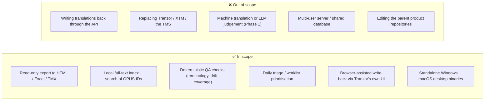
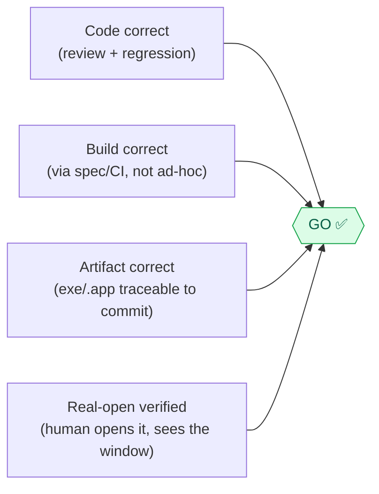
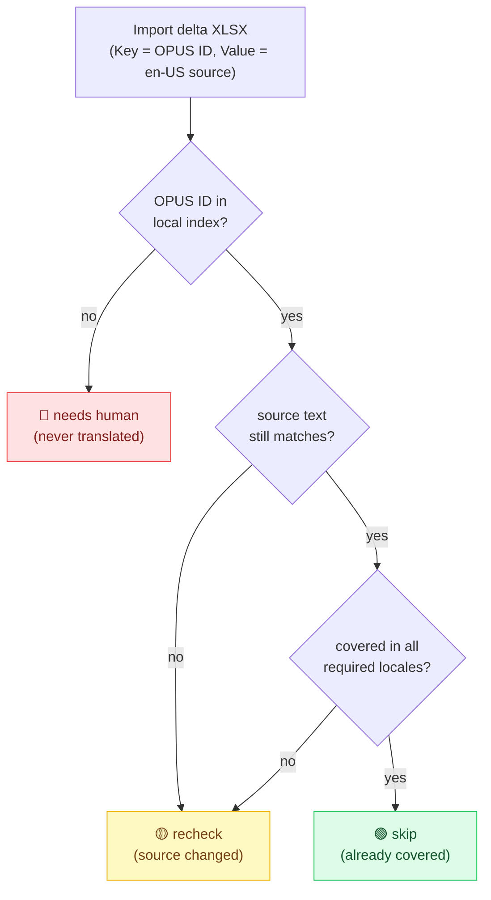

# SPEC — Tranzor Helper

> Specification of scope, rules, functional requirements and acceptance criteria.
> Companion documents: [README.md](README.md) · [ARCHITECTURE.md](ARCHITECTURE.md) · [RETROSPECTIVE.md](RETROSPECTIVE.md)

---

## 1. Problem statement & "rules of the game"

The challenge brief frames the deliverable as a game with *rules*. For a tool, the equivalent of "game rules" is the **domain logic and invariants** the software must obey to be trustworthy. Tranzor Helper operates in localization QA, where a wrong answer silently corrupts shipped product text in 18 languages — so its rules are strict.

### 1.1 The world it plays in

- **Tranzor** is RingCentral's localization platform (an XTM-style TMS front-end). It produces translations through **three channels**: *File Translation* (manual file jobs), *MR Pipeline* (GitLab merge-request-triggered), and *Scan Task* (coverage sweeps).
- Every translatable string has an **OPUS ID**: `RingCentral.{alias}.{md5(sourceRelativePath)}.{logicalKey}`. This is the primary key that ties all data together.
- Translations exist per **target locale** (~18 Tier-A locales: `de-DE, en-AU, en-GB, en-US, es-ES, es-419, fr-FR, fr-CA, it-IT, nl-NL, pt-BR, pt-PT, fi-FI, ko-KR, ja-JP, zh-CN, zh-TW, zh-HK`).
- The tool talks to the platform **read-only**; it never writes translations back through the API. Write-back happens only through Tranzor's *own* UI, which the user drives manually (optionally assisted by the Bridge).

### 1.2 The rules (invariants the software must never break)

| # | Rule | Rationale |
|---|---|---|
| R1 | **Read-only.** No API call mutates platform data. | The tool is a safety net, not a second source of writes. |
| R2 | **Completeness over silence.** An export must never *silently* drop a translation. If a fetch fails, retry; if it still fails, surface it (loudly) or refuse to emit. | A missing row looks identical to "string doesn't exist" — and causes wrong fixes. |
| R3 | **Newest-wins, deterministically.** When the same `(opus_id, target_language)` appears in multiple tasks, the latest by `created_at` wins — never "whichever thread finished last." | Reproducibility. |
| R4 | **Honest provenance.** Every value carries where it came from; uncertain origin is marked, never guessed. | "Silent wrong-fill" is the worst failure mode in this domain. |
| R5 | **Offline-first.** Every tab's first paint reads the local cache; the network is only touched on explicit Sync/Export. | The reviewer must be able to work anytime. |
| R6 | **Fail-safe UI.** An optional feature that breaks degrades to a missing tab — it never crashes the app. | One experimental tab cannot take down the daily workflow. |
| R7 | **No terminal, ever, for the end user.** All capability is reachable by click/select. | The user is a non-programmer. |
| R8 | **Secrets stay secret.** Store the JWT, never the password; never commit a token; inject auth only to allow-listed platform hosts. | Security. |

---

## 2. Scope definition

**MVP (delivered).** The first release (2026-04-02) shipped a 3-tab app: *File Translation*, *MR Pipeline*, *Quality Overview*. Everything beyond that — the other 11 tabs, the local index, the Bridge, CI binaries — is **incremental scope** added under the iteration model in [RETROSPECTIVE.md](RETROSPECTIVE.md).

**Explicit non-goals.** No write-back API; no attempt to be a TMS; no LLM-based quality judgement in the current phase (deterministic only, for reproducibility — LLM summaries are a roadmap item); single-user, local-only state (no server).

---

## 3. Functional requirements

Requirements are grouped by capability. Each has an ID (`FR-x`) referenced by the acceptance criteria in §4.

### 3.1 Export

- **FR-1 — Multi-format export.** Export translation data to **HTML** (interactive report), **Excel** (`.xlsx` via openpyxl), and **TMX 1.4** (browser-side, XTM-import-compatible).
- **FR-2 — Scope selection.** Export by single Task ID, by selected rows, by "all," or by **product × language** (Full Translations). "Export all" inherits the active Project/Release/Status filters.
- **FR-3 — Complete-or-fail-loud.** Full export retries failed task fetches with backoff; on permanent failure it records the failure and either reports it or (in strict mode) raises `IncompleteExportError` rather than emitting a partial file. *(Rule R2)*
- **FR-4 — Deterministic aggregation.** When a key appears in multiple runs, the newest by `created_at` wins; pagination overlaps are de-duplicated by `(opus_id, target_language, task_id)`. *(Rule R3)*
- **FR-5 — Provenance.** Full export records per-key `_all_sources`, picks a quality "winner," and flags inconsistencies between sources. *(Rule R4)*
- **FR-6 — Filenames identify the run.** Export filenames encode the task's *Created* time, not just the export day, so two exports of different runs never collide.

### 3.2 Local index & search

- **FR-7 — Local SQLite index.** Maintain `~/.tranzor_exporter/opus_index.db` (WAL mode) of every OPUS ID/string, keyed `(opus_id, target_language, task_id)`, with `opus_id` pre-split into `(alias, path_hash, logical_key)` columns.
- **FR-8 — Incremental & full sync.** Default sync pulls only tasks created after the last watermark; a full re-sync is available on demand.
- **FR-9 — Horizontal search.** **OPUS Search** finds matching distinct `opus_id`s by OPUS ID / source / translation / product and returns the **latest translation per language**. A query must narrow by at least one field (no bare full-table scan) and results are capped (≤ 2000).
- **FR-10 — GitLab baseline ingest.** `repo_corpus.py` parses merged locale files from GitLab product repos (driven by `products.json`) into the same index, making search "latest + most-complete." *(addresses the stale-upstream problem; see R-pivot in RETROSPECTIVE)*

### 3.3 QA checks (deterministic)

- **FR-11 — Terminology compliance (Term Watchtower).** Import an approved glossary; scan all three channels; flag each violation with expected vs. actual translation plus product / locale / key / workflow context; allow status marking; export HTML/Excel evidence. **No LLM** is used. Must remain usable with no glossary, no issues, or a partially failed source.
- **FR-12 — Pre-translation coverage.** Import an l10n delta XLSX (sheet `Data`: Key = OPUS ID, Value = source) and classify each string against the local index: 🟢 *skip (already covered)* / 🟡 *recheck* / 🔴 *needs human*.
- **FR-13 — Same-origin drift.** Group tasks by `(core product, MR#)`; where one MR triggered translation multiple times, fetch each run's latest translation and word-diff per locale; exclude failed fetches (do **not** mis-flag them as added/removed).
- **FR-14 — Error-keyword triage (Tranzor Checks).** Aggregate check failures by error type / language / keyword with a sortable keyword column and drill-down to issue rows.
- **FR-15 — Source re-hydration.** Where the backend truncates a source/translation preview, re-fetch the full text; one entry's failure must not poison the others.

### 3.4 Triage & workflow

- **FR-16 — Review Worklist.** Rank MRs by *merge urgency × language priority* (`compute_merge_urgency` scores state / merge-status / draft / upvotes / recency / labels), with translation-issue counts shown alongside; show a 🔴/🟡/🟢 risk dot; double-click opens the MR URL; Refresh recomputes from cache without re-sync.
- **FR-17 — Post-edit marker.** Show a ✏️ marker on tasks a human has revised; the marker cache must be invalidated on Search/Reset so a late fix is reflected.
- **FR-18 — Bridge handoff.** From any HTML report, ticking rows + "Send to Tranzor" opens the Tranzor task page with the matching String Keys highlighted and ticked across all languages.

### 3.5 Platform, packaging & security

- **FR-19 — Authentication.** Sign in via `POST /api/v1/auth/login`; store only the JWT (chmod 600); attach `Authorization: Bearer <jwt>` transparently to platform hosts **only** (never GitLab); prompt re-login before expiry. *(Rule R8)*
- **FR-20 — Internationalised UI.** Every screen toggles between English and 简体中文.
- **FR-21 — Standalone binaries.** PyInstaller produces a single-file Windows `.exe` and a universal2 macOS `.app`, each launching without a Python install. *(Rule R7)*
- **FR-22 — Concurrency safety.** Network I/O runs on background threads (≤ 8 workers) with retry/backoff and per-task isolation; the tkinter main thread is never blocked. *(Rule R1, performance)*

---

## 4. Acceptance criteria

Acceptance is **evidence-based**: most criteria below are pinned by an automated regression test (44 `test_*.py` files, mostly stdlib `unittest`). "Verified by" names the guarding test or the manual gate.

### 4.1 Functional acceptance

| Criterion | Met when… | Verified by |
|---|---|---|
| AC-1 (FR-3, FR-4) | A key present only in the newest run is **never** dropped; a failed task fetch is retried then recorded; strict mode raises on permanent failure. | `test_export_full_translations_complete.py` |
| AC-2 (FR-6) | Two exports of tasks with different Created times produce different filenames. | `test_mr_export_filename.py`, `test_scan_export_filename.py` |
| AC-3 (FR-9) | A search with no narrowing field is refused; LIKE metacharacters are escaped; results are capped at 2000. | `test_opus_search.py` |
| AC-4 (FR-13) | Repeat-MR runs are grouped; a failed fetch is **excluded**, not flagged as added/removed; duplicate `task_id` across page overlap is counted once; int/str MR# keys merge. | `test_same_origin.py` |
| AC-5 (FR-15) | A truncated source is re-hydrated from `/full-text`; one entry's HTTP failure leaves the others intact. | `test_tranzor_truncation.py` |
| AC-6 (FR-17) | Search/Reset drops only the relevant (`mr` / `scan`) post-edit cache kind and re-queries; a late Language-Lead fix flips the badge. | `test_mr_post_edit_cache_invalidation.py`, `test_scan_post_edit_cache_invalidation.py` |
| AC-7 (FR-11) | Terminology highlight spans are byte-for-byte identical to the proven flat-regex baseline across 20,000 random + adversarial inputs (CJK, shared prefixes, case folds). | `test_terminology_highlight_trie.py` |
| AC-8 (FR-19) | Auth header is injected only for allow-listed platform hosts and **never** for GitLab; only the JWT is persisted. | `test_tranzor_auth.py` |
| AC-9 (FR-18) | The Bridge enforces a userscript **version handshake** (test-verified); its transport hardening — loopback-only binding, shared-secret token gate, token-bucket rate limit — is enforced in `tranzor_bridge.py`. | `test_tranzor_bridge.py` (handshake) + source review |
| AC-10 (FR-22) | `ReadTimeout` is not retried; `ConnectionError`/`ConnectTimeout` retry up to `MAX_RETRIES`; default timeout is `(10, 120)`. | `test_api_timeout.py` |
| AC-11 (FR-2) | "Export all" inherits the active Project/Release/Status filters. | `test_collect_all_filters.py` |

### 4.2 Non-functional acceptance

| Criterion | Target |
|---|---|
| AC-12 — Cold start | App window appears quickly; tabs render lazily on first selection; bridge/auth bootstrap is async (off the UI thread). |
| AC-13 — Offline first paint | OPUS Monitor/Search, Review Worklist and Tranzor Checks render their first screen from the local DB with no network. |
| AC-14 — Footprint | Single-file binary; runtime deps limited to `requests` + `openpyxl`; bundle far smaller than a web-stack alternative (tkinter was chosen partly because a Gradio build was ~120 MB vs. ~25 MB). |
| AC-15 — Performance at scale | Terminology highlight uses a prefix-trie (≈1500× faster per line than the flat alternation) + memoization; search refuses unbounded scans of the ~1.27M-row index. |

### 4.3 Release acceptance (the "Go/No-Go" gate)

A build is **not** shippable on "compiled successfully" alone. Per [release_checklist.md](release_checklist.md), all four must hold:

If any one fails — including "the build merely succeeded but nobody opened it" — the answer is **No-Go**. This rule was learned the hard way from the Windows tkinter packaging incident (see RETROSPECTIVE §D).

---

## 5. Pre-Translation Check — worked example of a rule

The classification logic for FR-12 is the clearest small illustration of the tool's deterministic, offline-first philosophy:

The coverage decision is computed **entirely offline** against the local index; only fetching live scores or syncing fresh data requires login. This is the spec in miniature: deterministic, honest about uncertainty (🟡 when the source moved), and useful with zero network.
