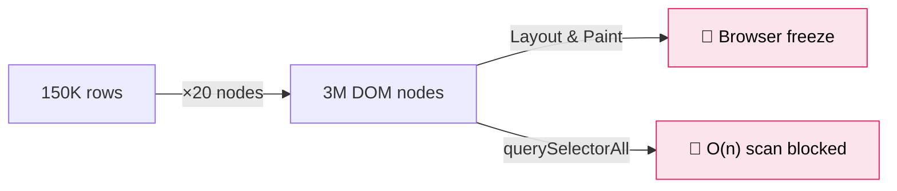
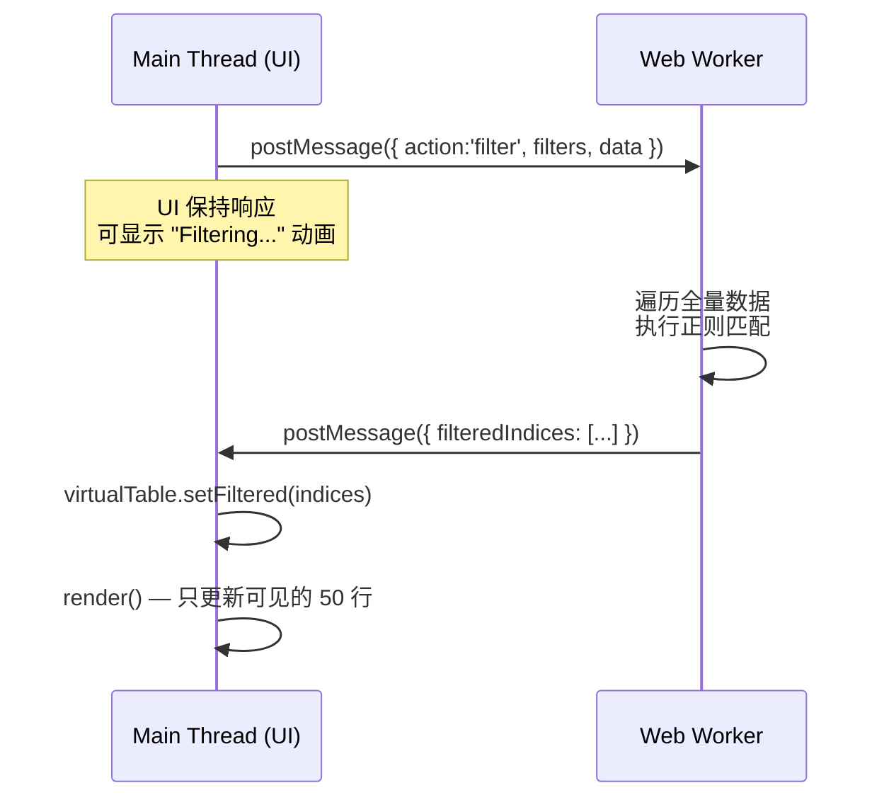
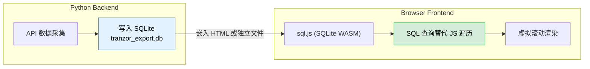
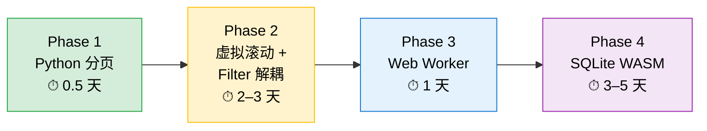

# TranzorExporter HTML 报告 — 大数据量性能优化方案

> **触发场景**: 用户导出全部任务的所有翻译，HTML 报告加载 ~150K 条数据（可达百万级），导致 Filters 无法打开、页面崩溃  
> **分析对象**: `export_translations.py` 中 `write_html()` 生成的静态 HTML 文件（在浏览器中打开）

---

## 1. 瓶颈分析 — 五层级诊断

以 **149,813 条数据** 为例，逐层量化当前实现的性能开销：

### 1.1 HTML 文件体积 — 解析阶段即溢出

```
每条 <tr> ≈ 500 bytes HTML
149,813 × 500 = ~75 MB 纯 HTML
```

加上内嵌的 `ROWS` JSON 数组（每条 ≈ 300 bytes）：

```
149,813 × 300 = ~45 MB JSON → 内联到 <script> 标签
```

**总文件体积 ≈ 120–150 MB。** 浏览器需要先下载/读取、解析整个文件，光这一步就可能耗时 10–30 秒。

### 1.2 DOM 节点数 — 渲染引擎崩溃

```
每条 <tr> 包含 9 个 <td> + 1 个 <input> = ~20 DOM 节点
149,813 × 20 = ~3,000,000 DOM 节点（仅表格部分）
```



> [!CAUTION]
> Chrome 在 DOM 节点超过 **~100K** 时开始明显卡顿，超过 **~1M** 时基本不可用。当前 3M 节点已远超极限。

### 1.3 Filter 逻辑 — 主线程同步阻塞

当前 `applyFilters()` 的工作流程（全部在 UI 主线程执行）：

```javascript
// 第 1 步：DOM 查询 — O(n)
const allRows = document.querySelectorAll('input.row-cb');  // 150K 次

// 第 2 步：逐行遍历 + 数据匹配 + DOM 操作 — O(n × m)
allRows.forEach(cb => {
    const idx = parseInt(cb.dataset.idx);
    const row = ROWS[idx];
    const tr = cb.closest('tr');              // DOM 树向上遍历
    // ... 正则匹配 ...
    tr.classList.add/remove('row-hidden');     // 触发 style recalc
});

// 第 3 步：section 级别同步 — 再次 O(n) querySelectorAll
```

**三重 O(n) 同步操作** 全压在主线程上，对 150K 行数据：
- `querySelectorAll` 扫描 ≈ 200–500ms
- `forEach` + `closest()` + `classList` ≈ 3–8s  
- style recalculation + layout ≈ 5–15s

**总阻塞时间 ≈ 10–25 秒**，用户看到的就是"网页不响应"。

### 1.4 Select All — 灾难性连锁

```javascript
getVisibleRowCheckboxes().forEach(cb => {
    cb.checked = allSelected;    // 150K 次 property 修改
    highlightRow(cb);            // 150K 次 classList 操作
});
updateBadge();                   // 又一次 querySelectorAll(':checked')
```

每个 checkbox 的 `checked` 修改都可能触发 change 事件冒泡 + 重绘，乘以 150K 次。

### 1.5 内存占用

| 数据源 | 占用估算 |
|--------|---------|
| `ROWS` JS 数组 (150K objects) | ~200 MB (V8 heap) |
| DOM 树 (3M nodes) | ~500–800 MB |
| 浏览器渲染层 (Layout tree) | ~200 MB |
| **合计** | **~1–1.5 GB** |

> [!WARNING]
> Chromium 单标签页默认堆上限约 **4 GB (64-bit)** 或 **1.5 GB (32-bit)**。150K 条数据已逼近极限，百万级会直接 OOM `SIGKILL`。

---

## 2. 前端/UI 层优化

### 2.1 虚拟滚动 (Virtual Scrolling) — 核心方案

**原理**: 无论数据有多少行，DOM 中只渲染**视口可见的行**（通常 30–50 行），通过滚动时动态替换行内容来模拟完整列表。

```
当前:  150,000 条 → 150,000 个 <tr>  → 3,000,000 DOM 节点
优化后: 150,000 条 → 50 个 <tr> (可见) → 1,000 DOM 节点
```


**实现方案**（纯 Vanilla JS，无框架依赖）：

```javascript
class VirtualTable {
    constructor(container, data, rowHeight = 36) {
        this.data = data;            // 全量数据引用 (不复制)
        this.filteredIndices = null;  // 筛选后的索引数组
        this.rowHeight = rowHeight;
        this.visibleCount = Math.ceil(container.clientHeight / rowHeight) + 10;
        
        // 创建滚动容器 + 占位元素
        this.scrollContainer = document.createElement('div');
        this.scrollContainer.style.cssText = 'overflow-y:auto; height:600px;';
        
        this.spacer = document.createElement('div');  // 撑开总高度
        this.tbody = document.createElement('tbody');
        
        // 按需渲染
        this.scrollContainer.addEventListener('scroll', () => this.render());
    }
    
    render() {
        const scrollTop = this.scrollContainer.scrollTop;
        const startIdx = Math.floor(scrollTop / this.rowHeight);
        const indices = this.filteredIndices || range(this.data.length);
        
        // 只生成 startIdx ~ startIdx+visibleCount 的 <tr>
        this.tbody.innerHTML = '';
        for (let i = startIdx; i < Math.min(startIdx + this.visibleCount, indices.length); i++) {
            this.tbody.appendChild(this.createRow(this.data[indices[i]], indices[i]));
        }
    }
}
```

**DOM 节点削减效果**：

| 数据量 | 当前 DOM | 虚拟滚动 DOM | 削减比 |
|--------|---------|-------------|--------|
| 10K | 200K | 1K | 200× |
| 150K | 3M | 1K | 3000× |
| 1M | 20M | 1K | 20000× |

### 2.2 Filter 操作与 DOM 解耦

当前的 `applyFilters()` 同时做了**数据过滤 + DOM 操作**。应拆分为：

```
┌─────────────────┐      ┌──────────────────┐      ┌─────────────────┐
│  Filter Logic   │ ──→  │ filteredIndices[] │ ──→  │ VirtualTable.   │
│  (pure data)    │      │ (integer array)   │      │   render()      │
│  在 JS Array 上 │      │ 与 DOM 无关       │      │ 只更新可见行    │
└─────────────────┘      └──────────────────┘      └─────────────────┘
```

```javascript
function applyFilters() {
    const filters = collectFilterState();
    
    // 纯数据操作：遍历 ROWS 数组，不接触 DOM
    const result = [];
    for (let i = 0; i < ROWS.length; i++) {
        if (matchesAllFilters(ROWS[i], filters)) {
            result.push(i);
        }
    }
    
    // 更新虚拟表格的索引 → 自动只渲染匹配的行
    virtualTable.filteredIndices = result;
    virtualTable.render();
    
    updateFilterInfo(result.length, ROWS.length);
}
```

**性能对比**：

| 操作 | 当前（DOM遍历） | 优化后（纯数据） |
|------|----------------|------------------|
| 150K 行过滤 | 10–25s (卡死) | 50–200ms |
| Select All | 5–15s (卡死) | 10–50ms |
| 页面响应 | ❌ 无响应 | ✅ 实时 |

### 2.3 Selection 状态用 Set 管理

```javascript
// 当前：每次 updateBadge() 都 querySelectorAll(':checked') — O(n)
// 优化：用 Set 追踪选中状态 — O(1) 查/增/删

const selectedSet = new Set();

function toggleSelect(idx) {
    selectedSet.has(idx) ? selectedSet.delete(idx) : selectedSet.add(idx);
    updateBadge();  // 直接读 selectedSet.size
}

function selectAll() {
    const indices = virtualTable.filteredIndices || range(ROWS.length);
    indices.forEach(i => selectedSet.add(i));
    virtualTable.render();  // 重渲染可见行时检查 Set
}
```

---

## 3. 数据处理与计算优化

### 3.1 Web Worker — 筛选计算剥离主线程

对于百万级数据，即使纯数据遍历也可能需要 500ms+。通过 Web Worker 将这部分计算放到后台线程：



```javascript
// filter-worker.js (运行在独立线程)
self.onmessage = function(e) {
    const { rows, filters } = e.data;
    const result = [];
    for (let i = 0; i < rows.length; i++) {
        if (matchesAllFilters(rows[i], filters)) {
            result.push(i);
        }
    }
    self.postMessage({ filteredIndices: result });
};

// 主线程
const worker = new Worker('filter-worker.js');
worker.onmessage = (e) => {
    virtualTable.filteredIndices = e.data.filteredIndices;
    virtualTable.render();
};
```

> [!NOTE]
> 由于当前 HTML 报告是单个自包含文件，Web Worker 需要通过 `Blob URL` 内联创建：
> ```javascript
> const workerCode = `self.onmessage = function(e) { ... }`;
> const blob = new Blob([workerCode], { type: 'application/javascript' });
> const worker = new Worker(URL.createObjectURL(blob));
> ```

### 3.2 分块渲染 (Chunked Rendering) — 轻量替代方案

如果不引入 Web Worker，也可以用 `requestIdleCallback` / `setTimeout` 分块：

```javascript
async function applyFiltersChunked() {
    const CHUNK = 10000;
    const result = [];
    
    for (let start = 0; start < ROWS.length; start += CHUNK) {
        const end = Math.min(start + CHUNK, ROWS.length);
        for (let i = start; i < end; i++) {
            if (matchesAllFilters(ROWS[i], filters)) result.push(i);
        }
        // 让出主线程 — 确保 UI 不卡死
        await new Promise(r => setTimeout(r, 0));
        updateProgress(start, ROWS.length);  // 显示进度
    }
    
    virtualTable.filteredIndices = result;
    virtualTable.render();
}
```

---

## 4. HTML 文件生成优化 (Python 端)

### 4.1 数据与视图分离

当前 Python 端同时生成了**全量 DOM HTML** 和**全量 JSON 数据**（双重冗余）。优化后：

```python
# 当前 (双重冗余):
sections_html = ""
for r in rows:
    sections_html += f"<tr><td>...</td></tr>"    # 150K 个 <tr>
rows_json = json.dumps(js_rows)                   # 150K 个 JSON 对象

# 优化后 (仅 JSON):
# Python 只输出 JSON 数据，不生成 <tr> 标签
# 前端通过虚拟滚动动态渲染
rows_json = json.dumps(js_rows, ensure_ascii=False)
sections_html = '<div id="tableContainer"></div>'  # 占位符
```

**文件体积变化**：

| | 当前 | 优化后 |
|--|------|--------|
| HTML DOM | ~75 MB | ~5 KB (骨架) |
| 内嵌 JSON | ~45 MB | ~45 MB |
| **总计** | **~120 MB** | **~45 MB** |

### 4.2 大数据集自动切换策略

```python
VIRTUAL_SCROLL_THRESHOLD = 5000  # 超过此阈值启用虚拟滚动

def write_html(rows, filename, label):
    if len(rows) > VIRTUAL_SCROLL_THRESHOLD:
        write_html_virtual(rows, filename, label)   # 虚拟滚动版
    else:
        write_html_classic(rows, filename, label)    # 当前全量渲染版
```

---

## 5. 架构级建议 — 长期演进

### 5.1 分页策略（推荐为**最先实施**的快速修复方案）

在不重构前端的前提下，最快见效的方案是 **Python 端分页生成多个 HTML 文件**：

```python
PAGE_SIZE = 5000

def write_html_paged(rows, base_filename, label):
    total_pages = math.ceil(len(rows) / PAGE_SIZE)
    for page in range(total_pages):
        start = page * PAGE_SIZE
        page_rows = rows[start:start + PAGE_SIZE]
        filename = f"{base_filename}_page{page+1}of{total_pages}.html"
        write_html(page_rows, filename, label + f" (Page {page+1}/{total_pages})")
```

优点：改动极小，立刻可用。  
缺点：跨页筛选不支持，TMX 导出需要分页操作。

### 5.2 本地数据库方案

对于百万级以上数据，最彻底的方案是引入本地数据库查询：



```sql
-- 过滤变为 SQL 查询 — 有索引时 O(log n)
SELECT * FROM translations 
WHERE language = 'de-DE' 
  AND source_text LIKE '%appointment%'
ORDER BY task_id
LIMIT 50 OFFSET 0;
```

### 5.3 方案对比总结

| 方案 | 改动量 | 效果 | 适用规模 | 推荐优先级 |
|------|--------|------|----------|-----------|
| **Python 端分页** | ⭐ 极小 | 立刻解决崩溃 | < 500K | 🥇 立刻实施 |
| **虚拟滚动** | ⭐⭐⭐ 中等 | 根治 DOM 问题 | < 5M | 🥈 近期实施 |
| **Filter 与 DOM 解耦** | ⭐⭐ 较小 | Filter 不再卡死 | 配合虚拟滚动 | 🥈 近期实施 |
| **Web Worker** | ⭐⭐ 较小 | 筛选不阻塞 UI | > 500K | 🥉 中期实施 |
| **SQLite (sql.js)** | ⭐⭐⭐⭐ 大 | 毫秒级查询 | > 5M | 🏅 长期演进 |

---

## 6. 推荐实施路径



| Phase | 目标 | 用户体验 |
|-------|------|---------|
| **Phase 1** | 分页导出，每页 ≤ 5000 行 | 不再崩溃，可逐页浏览和导出 TMX |
| **Phase 2** | 单文件虚拟滚动 + 数据层过滤 | 任意数量数据丝滑滚动和筛选 |
| **Phase 3** | Web Worker 异步过滤 | 百万级筛选 < 500ms，UI 零卡顿 |
| **Phase 4** | SQL 驱动查询 | 千万级即时查询，支持复杂条件组合 |
